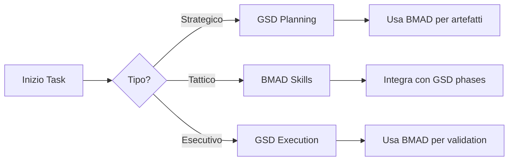

# BMAD + GSD Integration Guide
# Guida all'integrazione tra BMAD V6.3.0 e GSD

## Panoramica

Questa guida descrive come integrare **BMAD Method V6.3.0** con il sistema **GSD (Get Shit Done)** esistente per ottenere un workflow di sviluppo completo e potente.

## Il Sistema Ibrido

### Cosa offre ogni framework

| Framework | Punti di Forza | Ideale per |
|----------|---------------|-----------|
| **GSD** | - Ciclo di progetto strutturato<br>- Fasi chiare (analysis → planning → execution)<br>- Template personalizzati<br>- Configurazione project-based | - Gestione lifecycle completo<br>- Multi-progetti<br>- Team distribuiti |
| **BMAD** | - Workflow specializzati<br>- Artefatti specifici (PRD, architecture, etc.)<br>- Agenti specializzati<br>- Code review avversariali | - Specifici artefatti<br>- Code quality<br>- Decision making |

## Workflow Consigliato

### 1. Inizio Progetto
```bash
# 1. Genera project context (BMAD)
./bmad-gsd-helper.sh context

# 2. Avvia fase 1 di planning (GSD)
/gsd:plan-phase 1
```

### 2. Sviluppo Feature
```bash
# 1. Brainstorming (BMAD)
./bmad-gsd-helper.sh brainstorm "Nuova funzionalità"

# 2. Creazione PRD (BMAD)
./bmad-gsd-helper.sh create-prd "Nome feature"

# 3. Planning dettagliato (GSD)
/gsd:plan-phase 2 --features "Nome feature"

# 4. Sviluppo (BMAD)
./bmad-gsd-helper.sh quick-dev "Implementare feature X"
```

### 3. Quality Assurance
```bash
# 1. Code review (BMAD)
./bmad-gsd-helper.sh code-review laravel/Modules/FeatureX/ --focus security

# 2. Test generation (BMAD)
bmad-qa-generate-e2e-tests --path laravel/Modules/FeatureX/

# 3. Verification (GSD)
/gsd:verify-work 2
```

## Comandi Utili

### Quick Commands
```bash
# Status completo
./bmad-gsd-helper.sh status

# Genera artefatti BMAD
./bmad-gsd-helper.sh create-prd "Nome progetto"
./bmad-gsd-helper.sh brainstorm "Idea nuova"

# Sviluppo rapido
./bmad-gsd-helper.sh quick-dev "Fix bug X"
```

### GSD Commands
```bash
# Planning
/gsd:discuss-phase 1      # Brainstorming di fase
/gsd:plan-phase 1         # Piano dettagliato
/gsd:execute-phase 1      # Esecuzione
/gsd:verify-work 1        # Verifica

# Quick tasks
/gsd:quick "Descrizione task"
```

### BMAD Skills Accessibili
```bash
# Agent disponibili
bmad-help                 # Lista completa
bmad-brainstorming        # Ideazione
bmad-create-prd           # Product Requirements
bmad-quick-dev           # Sviluppo rapido
bmad-code-review         # Code review
bmad-create-architecture # Architecture design
bmad-create-ux-design    # UX design
```

## File di Configurazione

### 1. `.planning/gsd-bmad-integration.yaml`
Configurazione principale che definisce:
- Mapping tra fasi GSD e skills BMAD
- Quality gates combinati
- Workflow commands

### 2. `bmad-gsd-helper.sh`
Script di supporto per eseguire comuni operazioni combinate.

### 3. `.planning/STATE.md`
Aggiornato per includere stato BMAD.

## Best Practices

### 1. Quando usare GSD
- Per il lifecycle management
- Per la pianificazione delle fasi
- Per il tracking del progetto
- Per la documentazione strutturata

### 2. Quando usare BMAD
- Per creare artefatti specifici (PRD, architecture, UX)
- Per code review avanzati
- Per brainstorming mirati
- Per validazioni tecniche

### 3. Pattern di Integrazione


## Troubleshooting

### Problemi Comuni

1. **BMAD CLI non disponibile**
   ```bash
   # Usa lo wrapper script
   ./bmad-gsd-helper.sh <command>
   
   # Oppure usa i skills direttamente
   cd _bmad && bmad-<skill-name>
   ```

2. **Conflict di workflow**
   - GSD gestisce il lifecycle
   - BMAD gestisce gli artefatti
   - Non si sovrappongono

3. **Memory sharing**
   - GSD: `.planning/memory/`
   - BMAD: `_bmad/_memory/`
   - Usa link o copie quando necessario

## Esempi Pratici

### Esempio 1: Nuovo Modulo HR
```bash
# 1. Brainstorming
./bmad-gsd-helper.sh brainstorm "Nuovo modulo di valutazione performance"

# 2. PRD
./bmad-gsd-helper.sh create-prd "Performance Evaluation Module"

# 3. Planning
/gsd:plan-phase 3 --module performance

# 4. Sviluppo
./bmad-gsd-helper.sh quick-dev "Implementare performance evaluation"

# 5. Review
./bmad-gsd-helper.sh code-review laravel/Modules/Performance/
```

### Esempio 2: Bug Fix
```bash
# 1. Quick dev
./bmad-gsd-helper.sh quick-dev "Fix authentication timeout"

# 2. Update requirements
/gsd:quick "Update authentication requirements"

# 3. Test
bmad-qa-generate-e2e-tests --focus auth
```

## Next Steps

1. Personalizzare i template in `.gsd/templates/`
2. Configurare gli IDE rules per BMAD
3. Aggiornare la memory con convenzioni specifiche
4. Creare workflow custom per team specifici

## Risorse

- [GSD Methodology](./gsd-methodology.md)
- [BMAD Documentation](https://docs.bmad-method.org/)
- [Agent Skills](../../AGENTS.md#bmad-skills)