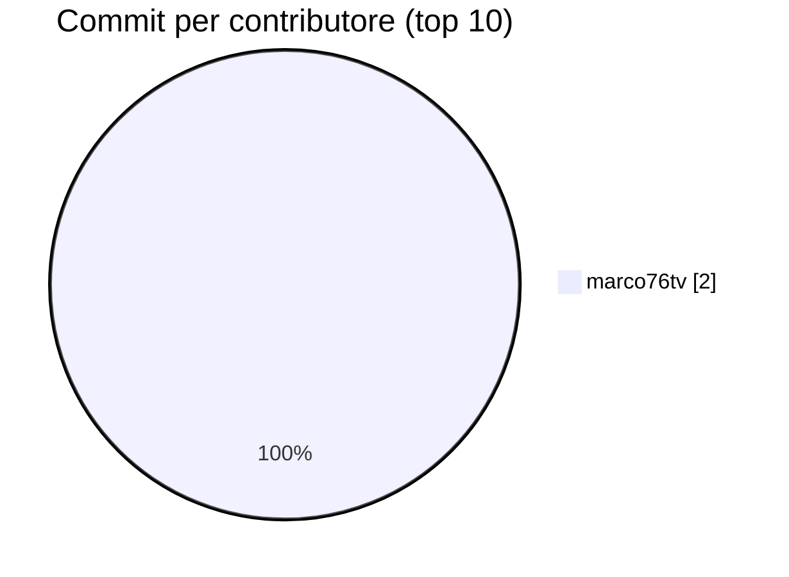
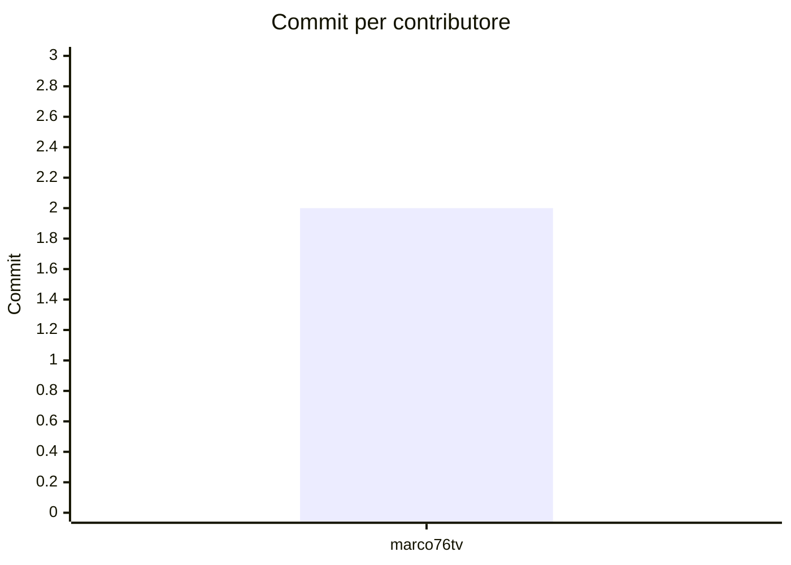
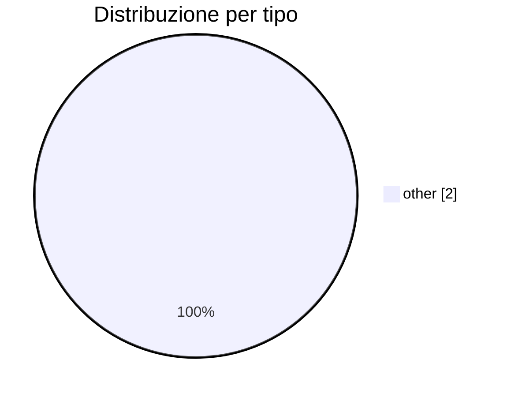
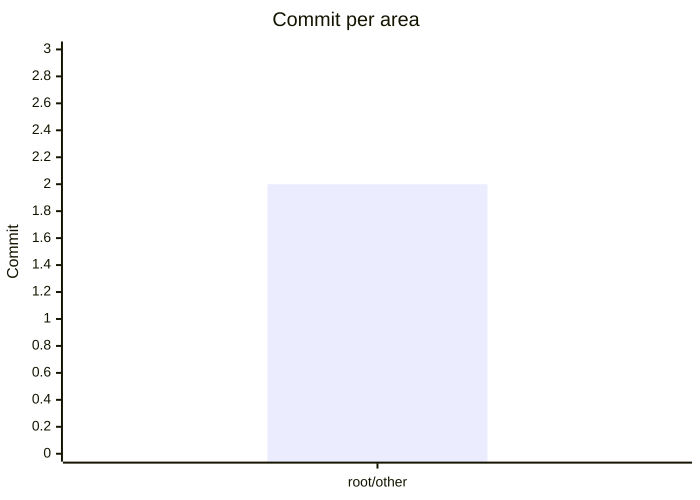

---
<<<<<<< .merge_file_2oKfH7
title: "Rimando a changelog-analytics.md"
description: "Documento unificato: il contenuto canonico vive in changelog-analytics.md."
status: merged
tags: [merge, duplicato, case-only]
---

# Documento unificato

Questo file era un duplicato esatto che differiva solo per maiuscole/minuscole, in violazione della regola no-case-only-variations. Il contenuto canonico si trova in [changelog-analytics.md](./changelog-analytics.md).
=======
title: changelog analytics report
type: report
tags: [changelog, contributors, ci, analytics]
generated: 2026-06-03T12:39:12.456Z
---

# Changelog analytics

- **Repository:** `local/repo`
- **Range:** `v1.0.0..HEAD`
- **Commits (no merge):** 2
- **Generato:** 2026-06-03T12:39:12.456Z

## Contributori

| Contributore | Email | Commit | % |
|-------------|-------|--------|---|
| marco76tv | marco.sottana@gmail.com | 2 | 100.0% |

## Tipi di commit (Conventional Commits)

| Tipo | Commit |
|------|--------|
| other | 2 |

## Moduli / temi toccati

| Area | Commit |
|------|--------|
| root/other | 2 |

## Ultimi commit

| Hash | Autore | Tipo | Messaggio |
|------|--------|------|-----------|
| `41c6ceb` | marco76tv | other | Update semantic-release workflow to trigger on all branches |
| `298ed1c` | marco76tv | other | Add push trigger for all branches in semantic versioning workflow |

_Report generato da `bashscripts/ci/generate-changelog-report.mjs`._
>>>>>>> .merge_file_0wemgf
