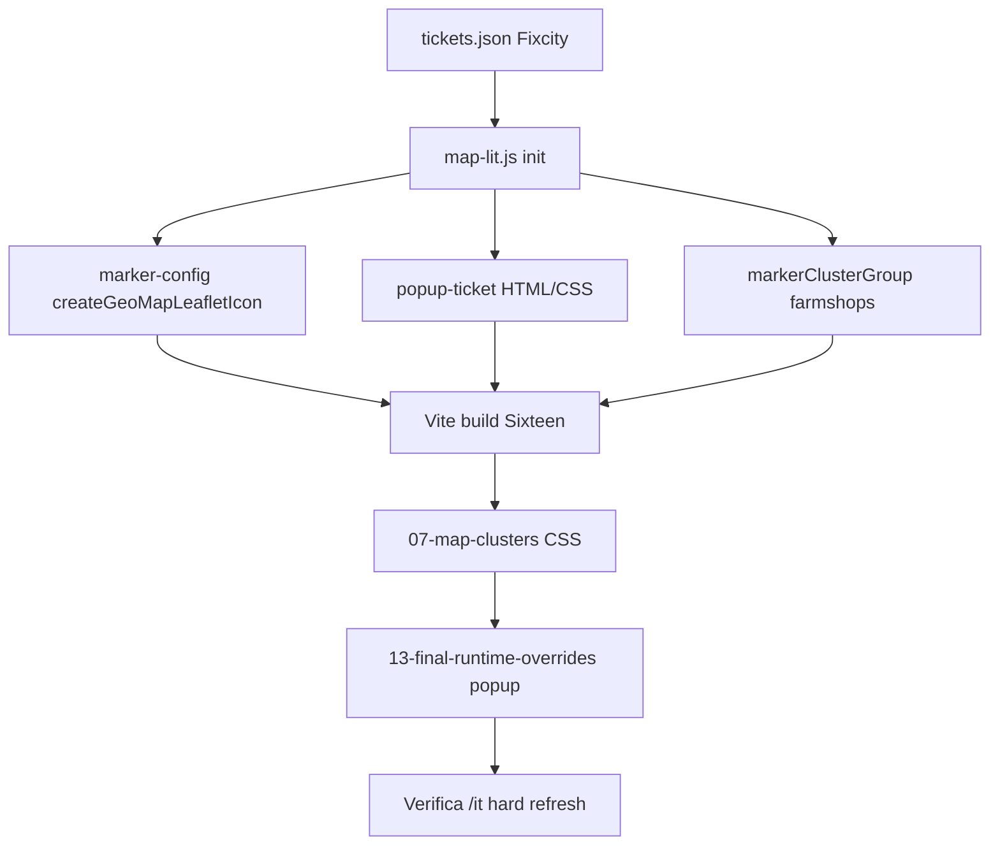

# geo-map-lit — registro correzioni e ricostruzione

## scopo

Indice **cronologico e funzionale** di ogni correzione significativa su mappa `/it`, con sintomo → causa → fix → file da rigenerare. Complementa la [guida ricostruzione](./geo-map-lit-reconstruction-guide.md) (contratto tecnico unico).

**Quando usarlo:** post-mortem, onboarding, o rebuild dopo perdita repository parziale.

---

## legenda colonne

| Campo | Significato |
|-------|-------------|
| ID | Riferimento incidente / story |
| Sintomo | Cosa vede il cittadino o il tester |
| Causa | Root cause tecnica |
| Fix | Cosa reimplementare |
| SSoT file | Dove vive la verità nel codice |

---

## registro

| ID | Sintomo | Causa | Fix | SSoT file |
|----|---------|-------|-----|-----------|
| INC-1 | Tab mappa vuota, 404 JS | Manifest/hash obsoleto, alias Vite | `npm run build` Sixteen; alias `lit`/`leaflet` in `vite.config.js` | `map-lit-vite-build-troubleshooting.md` (tema) |
| INC-2 | Marker spariscono dopo GPS | `removeOutsideVisibleBounds: true` + `setView` lontano | `removeOutsideVisibleBounds: false`; no `refreshClusters()` manuale | `map-lit.js` |
| INC-3 | Cluster tremano al hover | `transform: scale` su `.leaflet-marker-icon` | Hover solo `box-shadow`; no transform su wrapper Leaflet | `07-map-clusters-and-leaflet.css` |
| INC-4 | Trash gigante nel cluster | SVG tipo nel cluster + CSS globale | Pallini 14px `buildClusterTypeDotHtml` | `icon-glyph.js`, `map-lit.js` `_createClusterIcon` |
| INC-5 | Legenda tipologie assente | Control non sincronizzato | `legend.js` + `_syncMapLegend` su load/filtri | `map/legend.js` |
| INC-6 | Vuoto bianco popup prima di Tipologia | `header { min-height: 222px }` su `<header class="popup__header">` | `
` + `min-height: 0 !important` | `popup-ticket.js`, `13-final-runtime-overrides.css` |
| INC-7 | Pin piatto / punta staccata / stato illeggibile | Layout obsoleto `__body`, flex titolo popup, marker senza `__shell` | Pin: `__shell`→`__inner` 36px→`__glyph-pad`→`__point` 8px; anchor `[20,44]` | `marker-config.js` |
| INC-8 | Footer popup in loading via CSS | `.popup--loading .popup__footer { display:none }` | Modifier sul DOM: footer assente in loading | `popup-ticket.js`, `bem-modifier-dom-contract.md` |

---

## flusso ricostruzione (ordine consigliato)

1. Ripristinare `public_html/data/tickets.json` (action Fixcity).
2. Copiare/implementare `map-lit.js` + cartella `map/` da [geo-map-lit-reconstruction-guide.md](./geo-map-lit-reconstruction-guide.md).
3. Applicare override tema (cluster, marker, popup).
4. Build + manifest + smoke 12 marker.

---

## deprecazioni (non reintrodurre)

| Elemento | Motivo |
|----------|--------|
| `geo-popup-segnalazione*` | Block rinominato `popup` |
| `<header class="popup__header">` | Leak CSS header sito |
| `geo-map-marker-card__body` | Sostituito da `__inner` dentro `__shell` |
| Punta solo `::after` su card senza `__point` | Anchor e hover instabili |
| `flex: 1 1 100%` su `.popup__title` | Riga flex vuota sotto titolo |
| `refreshClusters()` dopo ogni pan | Race / marker spariti |
| `transform` su `.leaflet-marker-icon` | Cluster «scappano» |

---

## documentazione per layer

| Layer | Hub |
|-------|-----|
| Modulo Geo (SSoT) | [geo-map-lit-reconstruction-guide.md](./geo-map-lit-reconstruction-guide.md) |
| Incidenti operativi | [map-lit-it-incidents-2026-06.md](../troubleshooting/map-lit-it-incidents-2026-06.md) |
| Popup spacing | [map-popup-header-whitespace-fix.md](../troubleshooting/map-popup-header-whitespace-fix.md) |
| Marker stato/tipo | [geo-map-marker-status-background.md](./geo-map-marker-status-background.md) |
| Tema — leak header | [global-header-css-leak-leaflet-popup.md](../../../../../Themes/Sixteen/docs/wiki/troubleshooting/global-header-css-leak-leaflet-popup.md) |
| Tema — confine marker | [geo-map-marker-civic-pin-theme-boundary.md](../../../../../Themes/Sixteen/docs/wiki/concepts/geo-map-marker-civic-pin-theme-boundary.md) |
| Tema — integrazione pagina | [segnalazioni-elenco-map-integration.md](../../../../../Themes/Sixteen/docs/wiki/concepts/segnalazioni-elenco-map-integration.md) |
| Root progetto | [map-lit-reconstruction-hub.md](../../../../../docs/wiki/memories/map-lit-reconstruction-hub.md) |
| JSON + filtri | [map-lit-tickets-json-ssot.md](../../../../../Themes/docs/shared-components/map-lit-tickets-json-ssot.md) |

---

## stories

| Story | Tema |
|-------|------|
| STORY-121 | Visibilità mappa / build |
| STORY-122/124 | GPS + marker persistenza |
| STORY-123 | Cluster hover |
| STORY-128 | Filtri stato |
| STORY-129 | Marker + popup UX |
| STORY-130 | Sfondo stato marker |

Path: `docs/stories/STORY-12*.md`

---

## collegamenti

- [geo-map-lit-farmshops-parity.md](./geo-map-lit-farmshops-parity.md)
- [ticket-type-vs-status-map-semantics.md](./ticket-type-vs-status-map-semantics.md)
- [map-lit-lessons-learned.md](../../map-lit-lessons-learned.md)
