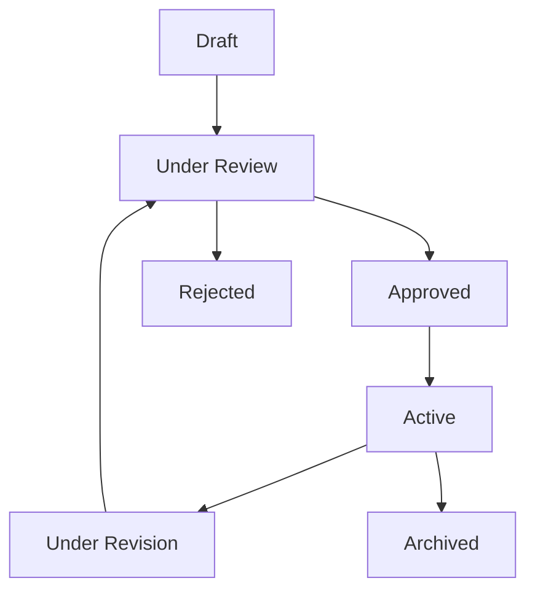

# Business Logic & Workflow

## 🎯 Core Business Rules

### Responsibility Evaluation Criteria

The system evaluates personnel based on three main criteria:

#### 1. Complessità (Complexity) - 0-40 points
- **Technical Complexity**: Depth of technical knowledge required
- **Problem Solving**: Level of analytical thinking needed
- **Innovation**: Degree of creative problem-solving required
- **Impact Scope**: Breadth of impact on organization

#### 2. Coordinamento (Coordination) - 0-30 points
- **Team Leadership**: Management of team members
- **Cross-functional Coordination**: Inter-departmental collaboration
- **Stakeholder Management**: External relationship management
- **Resource Allocation**: Budget and resource management

#### 3. Responsabilità (Responsibility) - 0-30 points
- **Decision Authority**: Level of autonomous decision-making
- **Risk Management**: Exposure to financial/operational risk
- **Accountability**: Consequences of decisions
- **Strategic Impact**: Influence on organizational strategy

### Score Calculation Formula
```php
$totalScore = complexity + coordination + responsibility;
$economicValue = calculateEconomicValue($totalScore, $category, $year);
```

## 🔄 Workflow States

### Evaluation Lifecycle



#### State Definitions

- **Draft**: Initial creation, editable
- **Under Review**: Submitted for approval, read-only
- **Approved**: Approved by supervisor, active
- **Rejected**: Returned for corrections
- **Active**: Currently in effect
- **Under Revision**: Being updated due to changes
- **Archived**: No longer active, kept for history

## 💰 Economic Value Calculation

### Category-Based Calculation

```php
function calculateEconomicValue(int $totalScore, string $category, int $year): float
{
    // Get category parameters
    $categoryData = ImportiCategoria::where('categoria', $category)
        ->where('anno', $year)
        ->where('ente', $ente)
        ->first();

    if (!$categoryData) {
        throw new CategoryNotFoundException("Category {$category} not configured for {$year}");
    }

    // Validate score range
    if ($totalScore < $categoryData->min || $totalScore > $categoryData->max) {
        throw new ScoreOutOfRangeException("Score {$totalScore} outside valid range");
    }

    // Calculate economic value
    $baseAmount = $categoryData->importo_base;
    $percentage = $totalScore / 100; // Convert to percentage

    return $baseAmount * $percentage;
}
```

### Adjustment Factors

- **Seniority Bonus**: Additional percentage based on years of service
- **Performance Multiplier**: Bonus/malus based on recent performance
- **Market Adjustment**: Regional cost-of-living adjustments
- **Special Allowances**: One-time bonuses for special circumstances

## 📧 Communication Workflow

### Automatic Notifications

#### Email Triggers
- **Creation**: Confirmation to employee and supervisor
- **Approval**: Notification to employee with PDF attachment
- **Rejection**: Feedback to employee with reasons
- **Updates**: Changes notification to all stakeholders

#### PDF Generation
```php
class GenerateResponsibilityReportAction
{
    public function execute(IndennitaResponsabilita $record): string
    {
        // Validate completion
        if (!$this->isEvaluationComplete($record)) {
            throw new IncompleteEvaluationException();
        }

        // Generate PDF with evaluation details
        return $this->pdfGenerator->generate([
            'employee' => $record->user,
            'evaluation' => $record,
            'scores' => $record->ratings,
            'economic_value' => $record->valore_economico_calcolato,
        ]);
    }

    private function isEvaluationComplete(IndennitaResponsabilita $record): bool
    {
        return $record->ratings()->count() >= 3 &&
               $record->valore_economico_calcolato > 0;
    }
}
```

## 🔐 Approval Workflow

### Multi-Level Approval

#### Level 1: Immediate Supervisor
- **Authority**: Up to 60 points total score
- **Timeline**: 3 business days
- **Escalation**: Automatic to Level 2 if not reviewed

#### Level 2: Department Head
- **Authority**: 61-80 points total score
- **Timeline**: 5 business days
- **Escalation**: HR involvement required

#### Level 3: HR Director
- **Authority**: 81+ points total score
- **Timeline**: 10 business days
- **Escalation**: Executive committee

### Approval Rules

```php
function canApprove(User $user, IndennitaResponsabilita $record): bool
{
    $totalScore = $record->complessita + $record->coordinamento + $record->responsabilita;

    return match($user->approvalLevel()) {
        1 => $totalScore <= 60,
        2 => $totalScore <= 80,
        3 => $totalScore > 80,
        default => false,
    };
}
```

## 📊 Reporting & Analytics

### Key Metrics Tracked

- **Average Scores**: By department, role, time period
- **Approval Times**: Average days for each approval level
- **Economic Impact**: Total allowances distributed
- **Completion Rates**: Percentage of evaluations completed on time
- **Rejection Rates**: Common reasons for rejection

### Automated Reports

- **Monthly Summary**: Department-level performance
- **Quarterly Review**: Organizational trends
- **Annual Report**: Comprehensive analysis
- **Ad-hoc Queries**: Custom reporting capabilities

## 🔄 Integration Points

### External Systems

#### HR Management System
- Employee data synchronization
- Organizational structure updates
- Role and responsibility changes

#### Payroll System
- Automatic allowance calculation integration
- Tax implications handling
- Payment processing coordination

#### Document Management
- PDF storage and retrieval
- Version control for evaluations
- Audit trail maintenance

## ⚡ Performance Optimizations

### Query Optimization
```php
// Eager loading for complex reports
$records = IndennitaResponsabilita::with([
    'user:id,name,email',
    'ratings:evaluation_id,value,type',
    'approvals:user_id,level,approved_at'
])
->whereYear('created_at', $year)
->get();
```

### Caching Strategy
- **Evaluation Templates**: Cached for 24 hours
- **Category Data**: Cached for 1 hour
- **User Permissions**: Cached per session
- **Report Results**: Cached for 1 hour

### Background Processing
- PDF generation queued
- Bulk email sending queued
- Report generation queued
- Data synchronization scheduled

---

**See Also**: [Assessment System](../features/assessment.md) | [Communication System](../features/communication.md) | [Rating System](../features/rating-system.md)
